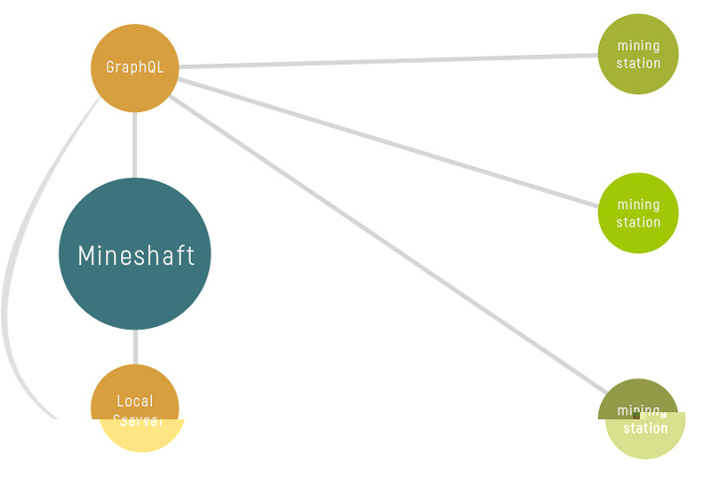
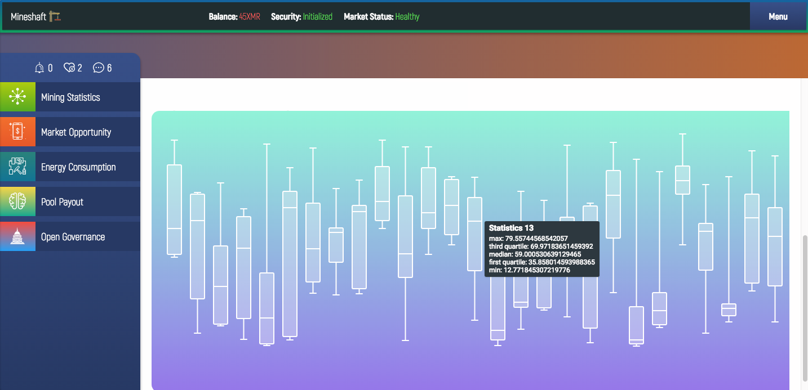
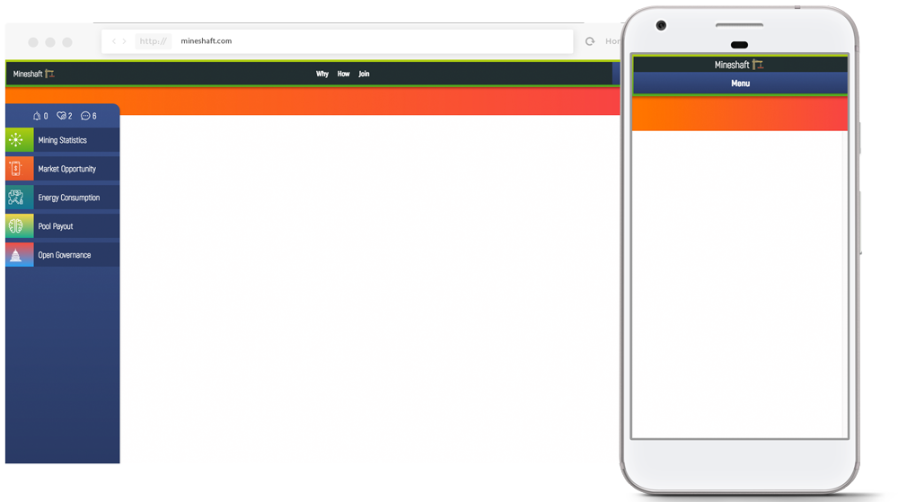

<p align="center"></p>
<h1 align="center"></h1>
<h2 align="center">Mining Operations Management<br/><br/></h2>
<p align="center">M.❤️ .M</p>
<p align="center">
 <em>Mining Infrastructure As A <strike>Service</strike> Community.</em>
</p>

<br />

<p align="center">
 
 <br /><br />
</p>

Mineshaft is Javascript + Cryptocurrency for the Desktop, Browser and Server.

The primary focus is to establish a standard for managing mining operation data. The standard will be used to make sharable data structures, which can be composed with more advanced data visualization components. For example, an easy-to-reason about GraphQL schema to request for hashing averages over a period of time, which can be passed to D3+VX charts, dendographs, trees, etc...

The secondary focus is to help abstract away low-level software management for day-to-day mining operators. Developers and Engineers know and love the benefits of Docker. To help mainstream adoption it might be in the best interested to help newcomers and non-technical folks with ready-to-go software environments for code coming from a diverse community of developers.

# **Premise**

1. Dedicated mining stations should have a minimal operating systems with limited (*if any at all*) interface components.

2. Mining operators might benefit from data structures standardization as it relates data storage and composition with data visuailization components.

3. A decoupled interface/database system for distributed mining station management, across separate networks, seperate from the "logistics" of computer networking, might provide the infrastructure for securely sharing a "pure" representation of "state" as agreed upon by the parts or the whole network.

# Mission
#### Decentralized cryptocurreny mining operations for maximum scalability, security and value creation.

**Scalable**: People First

**Security**: Less Code + More Sharing

**Value**: Distributed Workload + Resource Cycle Loop + Cryptocurrency Infrastructure

# Building The Infrastructure
#### The Mineshaft Infrastructure is 3 divided into Sectors: Desktop, Browser and Server.

Each Sector is responsible for developing Sector specific projects.

All 3 of the Sector's infrastructure are built with Javascript, hence Fullstack Javascript.

Each Mineshaft Sector is responsible to share Javscript/WebAssembly with each other as often as possible. You must find the people who need the code, instead of waiting for people who need it to find the code. Additionally, each Sector (unless designated otherwise) should prioritize sharability over low-level optimization. To better manage CPU intensive processing across devices/platforms, while also maintaining interpolablility, WebAssembly (.wast .wasm) will be used as the compiling target for low-level languages like C++/Rust/Go. To put it simply, we're staying in the V8, SpiderMonkey and Chakra playgrounds for safe, portable code across devices and operating systems.

## 🖥 Desktop
#### The Desktop Sector is responsible for *Mineshaft: Operating System Agnostic Desktop Application*.

Scenarios
- 1 Computer simulatanously runnning Mineshaft and performing hashing calculations.
- 1 Computer running Mineshaft, dispatching actions to ∞ (infinite) mining stations performing hashing calculations.
- 1 Computer playing Minecraft.

The **first** scenario is likely to cater to individuals new to cryptocurrency mining and/or uninterested in the complexities of running a full time mining operation. These people might have 1-3 dedicated computers, plus affordable electricity.

The **second** scenario is likely to cater to individuals/team/companies interested in large(r) pool mining operations. Additional tooling around storing, securing and analyzing data are probably high-value at a particular threshold.

*The **third** scenarios sounds fun.. I want in!*

## Distributed Mining
To handle communication between interfaces and mining stations, a GraphQL API/Server will be implemented within ~~Minecraft~~ Mineshaft.

Javascript Interfaces will use the Apollo React Client and C++ Mining Stations may add the [GrapQL Parser Library](https://github.com/graphql/libgraphqlparser) for dispatching/subscribing to the database.

The Mineshaft Desktop Application will instantiate an Express Server, responsible for interpreting the GraphQL queries/mutations. Passing query/muation payloads to the correct database(s). GraphQL provides robust "resolver" features, which translate to easy-to-understand nested queries/mutations, but complex data fetching across multiple databases, networks and services.

The easy-to-understand nested queries part is **super important**, because we need a reliable, *functional* method for passing complex data structures to the Dashboard Interface. The Mineshaft Dashboard relies heavily on the D3/VX/React for generating interactive and real-time charts, graphs, tress, dendographs, histograms, etc... In summary, we don't have the luxury of not controlling exactly how our data is structured for our interface, **literally** everything will break.



### The Future of Cross Compatibility - WebAssembly
Mineshaft will employ C++ and WebAssembly for even **better/faster/smarter/sexier** cross-platform capability

Essentially skipping past C++ bindings, but still incorporating low-level byte code optimizations directly into the Javascript development workflow \**yay*\*.

The Foundry directory, responsible for compiling, contains minerals (rawwww C++) and a smelt(compiled WebAssembly).

To operate the Foundry::Smelt one must first install the [WebAssembly Toolkit](https://www.npmjs.com/package/webassembly)

 ```yarn build:wasm```

 ```npm run build:wasm```

That being said, not ***all*** C++ will be compiled to WebAssebmly. 

Only essential low-level features will be made available to Javascript Application Developers: cryptography, verification, hashing, etc... ServiceWorkers (which can be shared on Desktop/Browser) will provide a simple interface for Frontend Developers to offload CPU intensive tasks using a standardized API.

In other words, adding new cryptocurrency features, that are both secure and people friendly, should be made as easy as possible (and no easier) to encourage broad community contribution. Broad community support will activate the "mission::maxiumumValueCreation()" method. Please and Thank You.

But... really since, the Browser and Server wasn't enough... Javascript Developers will also start ~~stealing~~ borrowing the world's best/performant/secure byte code to run in our sizzling 🌶 🔥 Reactive/Functional/Immutable Web Applications 🦄 so watch out oldschool cool, here come the newtool gang!

#### Design
<hr/>


- *Mockups. Wireframes. Fresh Ideas. We need them all.* If you're a Designer and/or User Interface/Experience efficianado you can contribute by adding new *and/or* refining existing Interface Components. Photoshop templates are avaiable for adding new atoms, components, containers, lists, section and pages to the Design Library.
- React Components/Containers design bundles will be built using the "artifacts" generated in the Design Library: property names, component type, etc... Code Slinging Javascript Developers will work directly with the Pixel Pushing Interface Designers to create the "best" cryptocurrency interface components the universe has even seen 🌝

***IMPORTANT - Essential Developer Tools ***

Ecmscripten and the WebAssembly Compiling Toolkit are required for contributors. *Please and thank you.*

WebAssembly Core: [GitHub Repo](https://github.com/juj/emsdk)

WebAssembly Toolkit: [Node Package](https://www.npmjs.com/package/webassembly)

### Features
- Monitor mining stations with a real-time, user friendly interface.
- Save mining logs and rig configuration with low maintenance NoSQL storage.
- Access Open Source Code Bazzar/Marketplace for automated software package management. 

## 💻 Browser

#### The Browser Sector is responsible for *Minelink: Progressive Web Application*.

The benefits of Minelink include offline-mode, cached resources, code-splitting and a dedicated ServiceWorker.

Additionally, the Browser Application ([Create React App](https://github.com/facebookincubator/create-react-app)) will have WebAssembly integration to help secure interface by encrypting/decrypting data it is passed to render components and dispatched from Store Departments.

Built using the same Frontend Technology stack as the Desktop Application, interface components will be easily shared. Put simply any advanced Graph Visualizations will work for both Desktop/Browser, without rewriting *any* code.

It's also advised to develop any new Interface features (even if it's intended for the Desktop Application) using the Browser Application development workflow. Yes... both workflows have Hot Reloading, but the Browser Application is ***significantly*** leaner, therefore compiles and renders much quicker.

Do whatever you want though *"It's just my opinion man"*.

<hr/>


- Responsive design for complex data visualizations and dashboard interactions.
- Secure device-to-device connection using WebRTC | Browser <=> Desktop

## 🚀 Server
#### The Server Sector is responsible for a collection of modular applications.

1. Interactive Terminal Interface
2. Browser Application Dashboard
3. Docker Package Management

**Interactive Terminal Interface**

The Interactive Terminal Interface is a fork of [React Blessed](https://github.com/Yomguithereal/react-blessed). An React Interface for (Blessed)[https://github.com/chjj/blessed] for high level terminal interface API using NodeJS.

**Browser Application Dashboard**
Mining Pool Operators (who choose to do so) may deploy the Pool Mining User Dashboard to help commercialize a mining pool operation. The Browser Application Dashboard will be will provide a user-friendly dashboard to handle day-to-day community management: rotating cellphone hotline, encrypted chat and system status checks.

[NodeJS Pool](https://github.com/Snipa22/nodejs-pool) is the first target, because... you guessed it "NodeJS".


- Update Dashboard layout to match the Desktop/Browser applications.
- Automated Docker deployment for new mining pools.
- Add Firebase Authentication/Database/Functions to manage mining community/support/hotline.

### Automation
- Free email/text notifications via Nodemailer.
- Control Mining Stations with simple "Yes" and "No" SMS prompts.
- Hourly, daily and weekly reports for mining operators.
- Monitor energy prices and CPU overclocking effectiveness.

### Data Management 
- Structured GraphQL Query/Mutation/Resolvers for [Apollo Client](http://dev.apollodata.com/) and [C++](https://github.com/graphql/libgraphqlparser) 
- Data-agnostic tables with custom filtering/editing operations. (http://blueprintjs.com/docs/#table-js)
- Postgres, NoSQL and Firebase Realtime Database for "desktop-browser-pool" synchronization.

### Design
- Adaptive gradient schemes signaling system/market status (*Preferable for people who process information visually*).
- Realtime Data Visualization with D3, VX, React and Redux Observables.
- Dynamic dashboard layouts for custom workflow and mining management.
- NOT FontAwesome Icons... It's 2017 people! Pay your designers, so we can get dope icons.

# Why


*We all have a thing or two to learn from Kanye* - Kanye

## How It Works
The Mineshaft "mining infrastructure as a ~~service~~ community" is Open Source **Desktop**, **Browser** and **Mining Pool** software.

**Built to empower mining operators.**

The primary objective is to "abstract away" the complexities of managing low-level mining software for better distributed scalability, while also supercharging **power miners** with enhanced data management and systems analysis.


### You Own The Infrastructure
For a variety of reasons (technical, philosophical and economic) Mineshaft is committed providing users with complete ownership of the complete software stack. The Desktop and Browser/Smartphone Application will have the ability to communicate directly, without relying on a "middle service" to manage the specifics of data transaction, storage or querying.

WebAssembly provides the compile target for C++ (hashing, cryptography, etc...) across Desktop/Smartphone applications. ecure/fast/verifiable byte code is the primary objective, to ensure mining operators maintain secure device-to-device communication capabilities at all times. Several months ago Browsers added support for WebAssembly, which is byte code (01010101) for the browser. The biggest complaint of running applications in the Browser has been Javascript simply wasn't up for the job.

The WebAssembly specification makes Browser Virtual Machines directly accessible for CPU intensive applications, bypassing Javascript compiling, garbage collection and possibly incorrect assumptions/automatons. Bleep...blooop..bleeep. Printing human translation. One moment please.

Mineshaft will take full advantage of WebAssembly and C++ in the Browser to help deliver the latest and great in user experience 🚀

***What's so great about compiling WebAssembly byte code from C++ for browser you ask?**

1. Secure
2. Sharable
3. Serverless 

# Secure
Internet Applications (specifically progressive web applications) can be secure by default, if users choose to install **service workers** to act as middleware for incoming/outgoing requests.

By passing responsibility to an entrusted **ServicerWorker/WebAssembly** combination, the dynamic-duo can **encrypt/decrypt** data as it's **leaving/exiting** the device interface.

**In other words, potentially the only time data, which has been encrypted by the mining operator, will be unecrypted is during the viewing process.**

During transmission across all networks (public/private) the data will be locked until reaching a designated interface. Unless accessing the database from a verified interface, even with direct access to the database, information will be unintelligible a'la cryptography. Obviously this is high level of security... and you might be right 

Byte code in the browser = fast/secure cryptography + automated service worker = secure by default.

A limiting factor to Internet security is the inherit complexity of cryptography. It's difficult to implement, harder to understand and inconvenient most of the time.

WebRTC, the peer-to-peer Browser specification, will provide a direct link between the Desktop and Smartphone applications. Once a direct link has been established, the Desktop and Smartphone (browser based applications) may communicate using C++/WebAssembly cryptography libraries.

# Sharable
Established C++ libraries, focused on security will be ported over to the applications running in the Browser, so Javascript developers can quickly and easily interact with compiled byte coding using ready-to-go service workers. By directly compiling C/C++ (.c/.cpp/.h) code into Browser ready WebAssembly (.wasm, .wast) significant improvements to common CPU intensive tasks can be more effectively managed.

More importantly, we can lower level of difficulty for code slingers to implement battle tested, scientist approved strategies for enabling security by default.

Why go through all the trouble?

Javascript developers love shiny, polished and ready-to-go libraries (I mean come on who doesn't though) and moving pixels around.

C++ developers live under rocks, occasionally blessing the world with crazy magic like this - wtf!

```
4ALdK1bRva8HoSbcfDrWGH3Kz4AnpensjHXZvojJdU8GGqEMSJSDBSScU7jtvA2kwLCB1T2XNdLRmUDe2fdGs8HaBn1iKfu
```

Let's combine the best of both worlds, so the people who don't like to stair at a blinking terminals and optimize pennies/watt can contribute to Cryptocurrency mining.

Mineshaft will lower the barrier of entry for Javascript developers accessing optimized, low-level byte code, while incentivizing C++ developers with automated distribution/cross-(platform/device/os/browser) compatibility.

# Serverless
Devices can communicate directly. Why add a middleman?

#### Desktop - Manage Day-to-Day Operations
**Technologies**: Electron (Muon?), React/Redux/Sagas/Webpack, Express, GraphQL, WebAssembly/C++

#### Smartphone - Manage Operations On-The-Go
**Technologies**: Progressive Web Application, Service Workers, WebAssembly 

Mineshaft is 2 separate applications, both sharing a similar codebase. The difference being the Browser application will connect to the Mineshaft Desktop Application, instead of the Express or GraphQL API directly. 
 

Therefore Mining Operation managers should interact with Mining Stations using a "decoupled" interface.

Essentially, Mineshaft will provide Mining Operators with a Dashboard for managing day-to-day operations. Managing datasets with a GraphQL Query/Mutate/Resolver paradigm for capturing (securely and efficiently) mining data decoupled from the underlying network infrastructure.

Mining operators can interact with mining information as it occurs or log mining operations for long term storage.

# Open Source Mining Bazaar
Mineshaft will provide a platform to locate and install software for mining cryptocurrency easily and quickly.

Cryptocurrency has officially entered the Early Adopter phase. Market prices are increasing 10x,100x,1000x. Browser mining is occurring on the Pirate Bay. Ethereum is having it's largest hackathon next month. Let's take a moment to 🥂 🎊 \*yay\*. We made it. Cryptocurrency (Blockchain) technology is changing the world and you were an innovator 💸 .


Instead of everyone stumbling down the same beaten path... together we'll forage the hills, tend the fields, pump the water and open the mines. It's right now we lay our stake in the ground and say "cryptocurreny for the people by the people". Yes, Open Source is a fantastic model for sharing software, but more important is the underlying infrastructure managing day-to-day operations.

ma can standardized toolsets, automate technical installations/configurations

[](https://en.wikipedia.org/wiki/Technology_adoption_life_cycle)

# Potential
Mining operators will have the ability to optimize mining performance and trends. Comparing mining information with market trends and price demands. Providing the ability to understand the optimal times to hold/sell successfully mined cryptocurrency.

### Foundry - Structuring Data
 The Foundry will compose log information using the data management/visualization components.

#### Technologies

*React*
Interface Components
*GraphQL*
The GraphQL implementation provides an easy-to-understand 2 way data flow model: queries and mutations. In addition to this simple 2-way data binding model for application clients, is a incredibly complex, yet easy to reason about schema/resolver system for managing data in a graph like structure a.k.a in multiple places and perhaps a little messy. 
[](http://graphql.org/)

## Dashboard

### Blueprint - D3 | Data Visualization & Management
Data management and comprhensive visualization is a top priority.

Via Blueprint (Palantir) and D3 (VX) advanced table management and real-time visualization can be quickly implemented. Interactive graphs and high-performant data management could provide continued profits for small and medium sized mining operations for a number of reasons.

### **Blueprint Tables - Advanced Data Sorting**
Mining rigs generate a steady-flow of structured data. What's important is the ability to organize the data in meaningful ways. The Blueprint Core and Blueprint Table library provide the ability arbitraility sort data using any number of unique parameters.

*"Because the table is data-agnostic, you can display complex data in the table and perform arbitrary operations on it."* 

Blueprint *is optimized for building complex, data-dense web interfaces for desktop applications.*
[](http://redux.js.org/)

### **D3 + VX - Real Time Data Visualization**
The VX React Library wraps the D3 data visualization library with React mentality of passing props down the DOM tree.


*"vx is collection of reusable low-level visualization components. vx combines the power of d3 to generate your visualization with the benefits of react for updating the DOM."*
[](https://vx-demo.now.sh/areas)

## GraphQL | Decoupled Data Flow
Mineshaft state management is implemented via the Apollo GraphQL Client (apollo-client) and Express Graphql (express-graphql) to manage retrieve complex data structures retrieval.

Mineshaft will interpolate with mining stations with a decoupled interface.

Communication will be unified across a query/mutate GraphQL API. Capturing and transform data from low-level mining software/equipment and accessible from any Internet connected device.

### How
Mineshaft will provide a flexible GraphQL schema for both the interface/mining software to "query" and/or "mutate" data using a NoSQL database.

### Why
Cryptocurrency is a fantastic progression in Internet technology. Limiting contributions to people who can tinker with terminals, compilers and watts/hour will limit growth capacity. It can be difficult for a technologically savvy person to get involved with cryptocurrency, let alone a beginner. Currently, cryptocurrency code repositories are slung across the internet, with digital breadcrumbs trailing behind.

## Additional Features
### Communication Infraustructre | Notifications, Prompts and Alerts;
Mineshaft will provide the abiltiy run a local server, accessible only to you, to monitor mining operations from any Internet connected device. In addition to monitoring mining operations, both *email* and *sms* message can be sent free of charge by the mining operator.

Email and text message can also act as two-way action prompts, so miners can receive and send commands to a machine, using predefined prompts and commands.

Sending/receiving actionable messages, miners could theoertically send a combination of advanced commands: toggling auto-power optimization, changing mining pools, alternating configurations and other mining related tasks. Either from email (which seems cumbersome) or from text message "command prompts".

### Example
Notification: Internet connection lost. Notification will be sent on reconnection.
Alert: Mining Pool is having technical difficulties. Send "Switch" or "Wait"
Optimization: 30 Day Trend Predicts 8:35pm to 4:21am will be optimal times. "Yes" to increase overclocking tonight.

#### Direct Link & Secure Communications
As it stands, a number of methods exist for direct device-to-device communcation. 

The most interesting perhaps though is *WebRTC*, because of it's unique *browser-to-browser* communicaiton capabilites. By adding a crptographic handshake via the WebRTC link (Mineshaft/Smartphone), theoretically a secure, around the cloud monitoring system could be established free of charge.

In addition no additional monthly charges to for a "middleman" to either store the data and/or provide querying services to anayze the data, the encrypted link could be managed solely by the mining operater. A number of security protocols can be established to ensure the mining operator is always the one in charge of the mining rig(s).

1. Public/Private Keys
2. Unique Device Identifier + Password
3. Limited Connections (1) At All Times 
